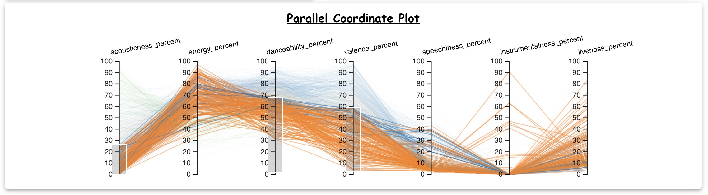

## Lab Description
In this lab, I have created a dashboard to vizualize data on K Means Plot, MDS Plot with Datapoints, MDS Plot with attributes and finally the Parallel Coordinate Plot (PCP). One goal of this lab is to understand and get more hands on experience with Different Tyepes of MDS plots and dimensionality reduction. One important goal here is to interpret the MDS Plot obtained especially the MDS Plot for the attributes. Another goal of this lab is to get hands on experience with creation of the PCP Plots and making interesting narratives out of the data obtained from the Parallel Coordinte Plots. Many interactivity elements and animations have been added to the frontend to enable the data scientist to draw observations like correlation in the data.  This dashboard has been made in accordance with the lab-2b for CSE 564 : Visualization & Visual Analytics course at Stony Brook University. 

## Dataset
I have used the same dataset that was used for Lab 1. The dataset comprises numerical features from Spotify tracks, focusing on attributes that quantify different aspects of the music. These attributes include the total number of streams, danceability, valence (positivity), energy, acousticness, instrumentalness, liveness, and speechiness percentages. Each feature plays a vital role in characterizing the musical pieces, from their suitability for dancing to the presence of acoustic elements and live performance aspects.

### Link to Dataset
https://www.kaggle.com/datasets/nelgiriyewithana/top-spotify-songs-2023


## How to Run
There are two servers created for this project. 

1. **Python based Flask Backend Server** - This server is used to do the heavy calculations like PCA , KMeans, etc. This server exposes several APIs that server to provide the frontend with the data that is needed for rendering the plots.  
2. **React based Frontend Server** - This server is mainly used to serve the UI which includes the Scree Plot, the PCA Based Biplot, the K Means MSE Plot, the Scatterplot Matrix. This server fetches all the data that it needs to server from the flask server. 

### Run the python server
1. Run the below commands
```bash
	cd ./backend
	pip3 install -r requirements.txt
	python3 server.py
```

Preferably use python3.9 for running the above server because development and testing has been done on python3.9

### Run the frontend server
1. Run the below commands
```bash
	npm install
	npm start
```

### Multi Dimensional Scaling (MDS)
MDS is a technique used to analyze the similarity or dissimalirity of the data. It helps in visualizing the level of similarity and dissimilarity of the data. MDS tries to model the similarities or dissimilarities into geometric spaces usually 2D or at max 3D graphs for better visualization and understanding of the relations in the data. There are two ways we are using MDS in this lab. 
1. The first way is to observe the similarity/dissimilarity between individual rows of the dataset itself. This is done by feeding MDS the dataset itself and using the distance as euclidean distance. 
2. The second way is to observe the similarity/dissimilarity between the attributes. Here we represent each point as one attribute on the MDS Plot. Variables/attributes that are close together on the MDS Plot are highly correlated or exhibit similar patterns. For example, in a dataset related to nutrition, you may find that all variables related to sugar content are placed close by. Furthermore, variables that are placed relatively far apart are less correlated or exhibit dissimlar patterns This allows us to group attributes on the Parallel Coordinate Plot and ultimately draw conclusions or find interesting narratives using the data. This is done by feeding MDS, the dissimilarity matrix. 

### Parallel Coordinate Plot (PCP)
The true strength of PCPs are that it allows a user to visualize multidimensional data into 2 Dimensions. This is esepcially usefull for exploratory data analysis because it offers a way to visually figure out patterns, outliers, etc. Ways to use PCPs are
1. Exploratory Data Analysis - By observing how lines move across the dataset, one can potential correlations or inverse relations between the attributes. As lines deviate from the cluster, outliers can be easily spotted.
2. Feature Selection - PCPs can be used for feature selection because they show the variance of the feature. Features that show little or no variance can be visually detected and dropped. Furthermore, features that are uniformly distributed irrespective of the custering (in case of lines being coloured by cluster id) can potentially also be dropped during the clustering. This is because those variables with the uniform distribution are potential noise and do not contribute much to the clustering. Furthermore, we can also detec important features for the clustering algorithm by using the brushing feature on PCPs.
3. Time Series Analysis - We can add one axis as the time axis and using the brushing feature, we can illustrate how relationships between variables evolve over time. 

Please note that for PCPs below are some good practices, 
1. The order of axes (dimensions) can significantly affect the readability of the plot. Placing highly correlated dimensions next to each other can make patterns more apparent.
2. Using color to differentiate lines based on certain criteria (like cluster membership or categorical variables) can greatly enhance the interpretability of PCPs.

One of the major disadvantage of PCP when compared to an MDS Plot is that PCP allows us to compare only two adjacent features (in terms of comparing similarity/dissimilarity/correlation)
One major advantage of PCP over MDS plot is that in MDS plot we cannot figure out the type of correlation (inverse correlation or direct correlation), but on the other hand in a PCP based on the interaction between two adjacent axis, we can figure out the different correlations between the dataset


### Interesting Observations from MDS

#### Detecting highly correlated features 
acousticness_percent and energy_percent are quite close on the plot, suggesting that they may be positively correlated. This means that when acousticness_percent is high, energy_percent also tends to be high, or vice versa. 

#### Detecting clusters of features

Some variables in my dataset form loose clusters that they may share some similar properties or are influenced by similar factors. For example, valence_percent, danceability_percent, and speechiness_percent form a cluster at the bottom center of the plot. This could mean tracks that are more danceable also tend to have more spoken words and convey a happier mood (higher valence). It may reflect a genre-specific trend like pop music, where catchy and lyrically dense songs tend to be both danceable and have a higher valence. This narrative does make sense because we dont tend to dance too much on sad songs.  

#### Detecting Independence of Features
instrumentalness_percent is slightly isolated and does not cluster tightly with any other variable. This could potentially mean that instrumentalness_percent does not strongly correlate with any of the other measured attributes and consequently might have a unique characteristic independent of other attributes. Again this is a fairly loose observation because in my MDS plot the points are almost equidistant. 

#### Absence of strong clusters

There are no exceptionally strong correlations between the features because there are no points overlapping or partially overlapping or very close by. This may mean that most of the feature that are chosen bring something partially unique to the dataset. 

Please note that the above are only visual interpretations that are drawn, these visual interpretations should be confirmed via various statistical methods that are not covered in this course. 

### Interesting Observations from the PCP

Lets divide the danceability into 3 parts, high_danceability, low_danceability_type_1 and low_danceability_type2. When we choose 3 clusters in the KMeans Plot, lets try to analyze the three clusters and the relation to the danceability. 

1. High Danceability cluster - Blue Cluster - Below diagram provides a way to identify such songs. 


2. Low Dance Danceability Type 1 - Orange Cluster -The Bottom 75 Percent of songs in terms of danceability, where the acousticness is low. Below diagram provides a way to identify such songs.
   
 

3. Low Danceability Type 2 - Green Cluster - The bottom 75 percent of songs in terms of danceability where the acousticness is high. Below diagram provides a way to identify such songs. 


